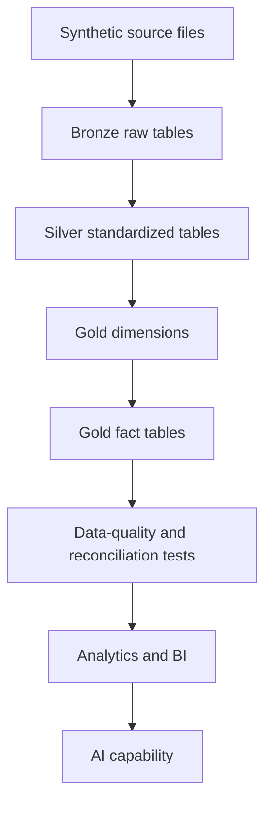

# Lakehouse Build Plan

## Objective

Build an idempotent eCommerce data platform using the medallion architecture:

```text
Source → Bronze → Silver → Gold → Analytics/BI → AI
```

Each layer has a distinct responsibility:

| Layer | Responsibility |
|---|---|
| Source | Simulated operational eCommerce data |
| Bronze | Preserve raw source records and ingestion metadata |
| Silver | Clean, standardize, deduplicate and protect sensitive data |
| Gold | Create conformed dimensions and business-ready facts |
| Analytics/BI | Define reusable metrics and reporting models |
| AI | Add natural-language analysis or intelligent recommendations |

## Pipeline Flow



## Phase 1: Synthetic Source Data

Create realistic source files for:

1. Products
2. Customers
3. Orders and order lines
4. Shipments and shipment lines
5. Returns and return lines
6. Inventory snapshots
7. Marketing performance
8. Reference data

The synthetic data must include controlled edge cases:

- Duplicate source records
- Null optional values
- Split shipments
- Partial cancellations
- Partial returns
- Refunds without physical returns
- Late-arriving customers
- Customer attribute changes
- Negative available inventory
- Unknown return reasons
- Multiple source systems
- Reprocessed files

## Phase 2: Bronze Layer

### Purpose

Preserve the original source data with minimal transformation.

### Bronze Operations

- Read source files.
- Preserve source columns.
- Add ingestion metadata.
- Append raw records.
- Retain duplicate records.
- Retain source timestamps.
- Avoid applying business logic.

### Standard Bronze Metadata

```text
_ingested_at
_source_file
_source_system
_batch_id
_record_hash
```

### Bronze Tables

```text
bronze.products
bronze.customers
bronze.order_lines
bronze.shipment_lines
bronze.return_lines
bronze.inventory_snapshots
bronze.marketing_performance
```

Bronze is append-only so the raw arrival history can be audited and replayed.

## Phase 3: Silver Layer

### Purpose

Convert raw records into validated, standardized domain tables.

### Silver Operations

- Enforce schemas and data types.
- Standardize column names.
- Normalize status values.
- Convert timestamps to UTC.
- Derive Pacific business dates.
- Standardize USD monetary fields.
- Deduplicate records.
- Quarantine invalid records.
- Encrypt required restricted PII.
- Generate customer tokens.
- Standardize reference values.
- Retain source business keys.

### Silver Tables

```text
silver.products
silver.customers
silver.order_lines
silver.shipment_lines
silver.return_lines
silver.inventory_snapshots
silver.marketing_performance
silver.quarantine_records
```

Silver contains business entities that are clean enough to use when constructing dimensions and facts.

## Phase 4: Gold Dimensions

Build dimensions before facts because facts require surrogate foreign keys.

### Dimension Build Order

1. `gold.dim_date`
2. `gold.dim_product`
3. `gold.dim_location`
4. `gold.dim_channel`
5. `gold.dim_campaign`
6. `gold.dim_return_reason`
7. `gold.dim_shipping_service`
8. `gold.dim_customer`

### Reason for the Order

- `dim_date` is generated independently.
- Type 1 reference dimensions are built before dependent facts.
- `dim_customer` requires the most complex logic because it includes Type 2 history, inferred members and protected identifiers.

Every dimension must include an unknown member:

```text
surrogate_key = 0
```

## Phase 5: Gold Facts

### Fact Build Order

1. `gold.fact_sales`
2. `gold.fact_inventory_snapshot`
3. `gold.fact_shipments`
4. `gold.fact_returns`
5. `gold.fact_marketing_performance`

### Reason for the Order

`fact_sales` is built first because shipment and return reconciliation depends on ordered and non-cancelled quantities.

Inventory and marketing are analytically independent, but they still require their conformed dimensions.

### Fact Loading Pattern

Each current-state fact uses an idempotent `MERGE`:

```text
Not matched:
    INSERT

Matched with newer source_updated_at:
    UPDATE

Matched with older or identical source_updated_at:
    IGNORE
```

## Phase 6: Validation and Reconciliation

Run table-level tests during each transformation and cross-table reconciliation after Gold facts are loaded.

### Dimension Tests

- Surrogate keys are unique.
- Natural business keys follow the defined uniqueness rule.
- Unknown key `0` exists.
- Current customer records are unique by customer token.
- Type 2 customer date ranges do not overlap.
- No direct customer PII appears in Gold.

### Fact Tests

- Business keys are unique.
- Required dimension keys are not null.
- Every dimension key resolves to a dimension row.
- Monetary fields use USD.
- Quantities and amounts follow domain rules.
- Source update ordering is respected.

### Cross-Fact Reconciliation

```text
shipped_quantity
<= ordered_quantity - cancelled_quantity
```

```text
returned_quantity
<= delivered_quantity
```

Approved exceptions must be identified rather than silently removed.

## Phase 7: Analytics and BI

Create an analytics layer containing reusable business metrics:

- Gross sales
- Net sales
- Net ordered sales
- Units ordered
- Units shipped
- Units returned
- Return rate
- Cancellation rate
- Average order value
- Inventory availability
- Backorder quantity
- Delivery lead time
- Marketing spend
- CTR
- CPC
- Conversion rate
- Platform-reported ROAS

BI development begins only after Gold tables pass validation.

## Phase 8: AI Enhancement

Potential AI functionality:

- Natural-language eCommerce performance summaries
- Product-level anomaly explanations
- Inventory-risk summaries
- Return-reason summarization
- Marketing-performance recommendations

The AI component must use governed Gold or analytics data rather than raw Bronze records.

## Initial Implementation Sequence

```text
1. Create repository folders
2. Generate synthetic products and customers
3. Generate transactional source data
4. Build Bronze ingestion framework
5. Build Silver standardization framework
6. Build Gold dimensions
7. Build Gold facts
8. Add automated tests
9. Add orchestration and logging
10. Build analytics outputs
11. Add BI
12. Add AI functionality
```
