# eCommerce Lakehouse ERD

This diagram represents the Gold-layer dimensional model. Facts share conformed dimensions and are not joined directly for routine analytics.

```mermaid
erDiagram
    DIM_DATE ||--o{ FACT_SALES : "order/cancellation date"
    DIM_PRODUCT ||--o{ FACT_SALES : "product"
    DIM_CUSTOMER ||--o{ FACT_SALES : "customer version"
    DIM_CHANNEL ||--o{ FACT_SALES : "sales channel"

    DIM_DATE ||--o{ FACT_SHIPMENTS : "shipment/delivery date"
    DIM_PRODUCT ||--o{ FACT_SHIPMENTS : "product"
    DIM_CUSTOMER ||--o{ FACT_SHIPMENTS : "customer version"
    DIM_LOCATION ||--o{ FACT_SHIPMENTS : "ship-from location"
    DIM_CHANNEL ||--o{ FACT_SHIPMENTS : "sales channel"
    DIM_SHIPPING_SERVICE ||--o{ FACT_SHIPMENTS : "shipping service"

    DIM_DATE ||--o{ FACT_RETURNS : "return/refund date"
    DIM_PRODUCT ||--o{ FACT_RETURNS : "product"
    DIM_CUSTOMER ||--o{ FACT_RETURNS : "customer version"
    DIM_LOCATION ||--o{ FACT_RETURNS : "processing location"
    DIM_CHANNEL ||--o{ FACT_RETURNS : "sales channel"
    DIM_RETURN_REASON ||--o{ FACT_RETURNS : "return reason"

    DIM_DATE ||--o{ FACT_INVENTORY_SNAPSHOT : "snapshot date"
    DIM_PRODUCT ||--o{ FACT_INVENTORY_SNAPSHOT : "product"
    DIM_LOCATION ||--o{ FACT_INVENTORY_SNAPSHOT : "inventory location"

    DIM_DATE ||--o{ FACT_MARKETING_PERFORMANCE : "activity date"
    DIM_CHANNEL ||--o{ FACT_MARKETING_PERFORMANCE : "marketing channel"
    DIM_CAMPAIGN ||--o{ FACT_MARKETING_PERFORMANCE : "campaign"

    DIM_DATE {
        int date_key PK
        date full_date
        int calendar_year
        int calendar_month
        string fiscal_year
        int fiscal_month
    }

    DIM_PRODUCT {
        bigint product_key PK
        string product_id UK
        string product_name
        string brand
        string category
        string subcategory
    }

    DIM_CUSTOMER {
        bigint customer_key PK
        string customer_token
        string customer_segment
        string loyalty_tier
        string region
        date effective_from
        date effective_to
        boolean is_current
        boolean is_inferred
    }

    DIM_LOCATION {
        bigint location_key PK
        string location_id UK
        string location_name
        string location_type
        string region
    }

    DIM_CHANNEL {
        bigint channel_key PK
        string channel_id UK
        string channel_name
        string channel_group
    }

    DIM_CAMPAIGN {
        bigint campaign_key PK
        string campaign_id
        string source_system
        string campaign_name
        string campaign_type
    }

    DIM_RETURN_REASON {
        bigint return_reason_key PK
        string return_reason_code UK
        string return_reason
        string return_reason_group
    }

    DIM_SHIPPING_SERVICE {
        bigint shipping_service_key PK
        string carrier_name
        string service_level
        string service_category
    }

    FACT_SALES {
        bigint sales_key PK
        string source_system
        string order_id
        string order_line_id
        int order_date_key FK
        bigint product_key FK
        bigint customer_key FK
        bigint channel_key FK
        int ordered_quantity
        decimal net_sales_amount
        string order_line_status
    }

    FACT_SHIPMENTS {
        bigint shipment_key PK
        string shipment_id
        string shipment_line_id
        int shipment_date_key FK
        bigint product_key FK
        bigint customer_key FK
        bigint location_key FK
        bigint channel_key FK
        bigint shipping_service_key FK
        int shipped_quantity
        int delivered_quantity
    }

    FACT_RETURNS {
        bigint return_key PK
        string return_id
        string return_line_id
        int return_date_key FK
        bigint product_key FK
        bigint customer_key FK
        bigint location_key FK
        bigint channel_key FK
        bigint return_reason_key FK
        int returned_quantity
        decimal refund_amount
    }

    FACT_INVENTORY_SNAPSHOT {
        bigint inventory_snapshot_key PK
        int snapshot_date_key FK
        bigint product_key FK
        bigint location_key FK
        int on_hand_quantity
        int reserved_quantity
        int available_quantity
        decimal inventory_value
    }

    FACT_MARKETING_PERFORMANCE {
        bigint marketing_performance_key PK
        int activity_date_key FK
        bigint channel_key FK
        bigint campaign_key FK
        decimal spend_amount
        bigint impressions
        bigint clicks
        decimal platform_attributed_revenue
    }
```

## Relationship Notes

- `DIM_DATE` is a role-playing dimension used for several date fields.
- `DIM_CUSTOMER` can contain multiple historical versions of one customer.
- Order, shipment and return identifiers remain inside facts for traceability.
- Facts share dimensions but should not be directly joined for normal aggregation.
- Some implementation and audit columns are omitted to keep the ERD readable.
